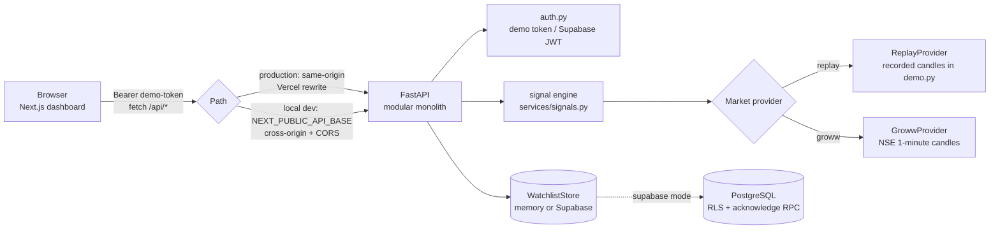
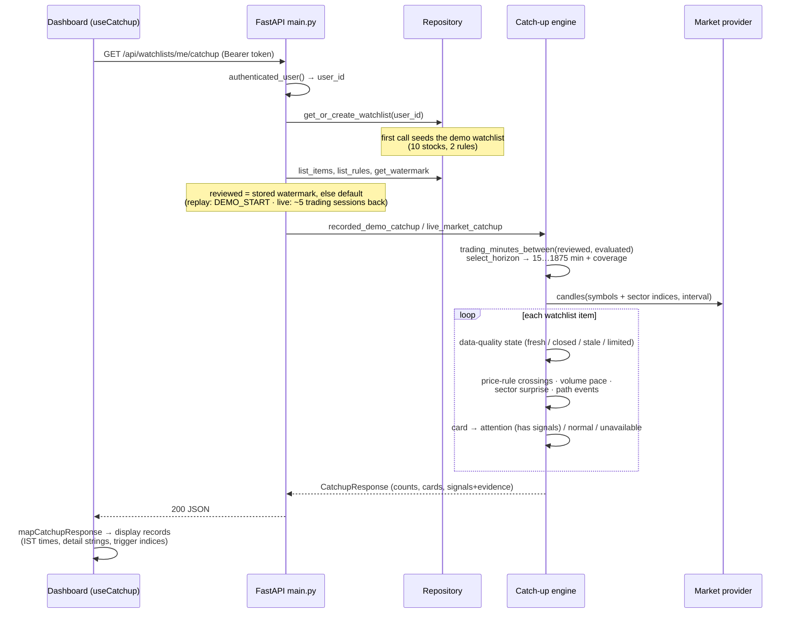
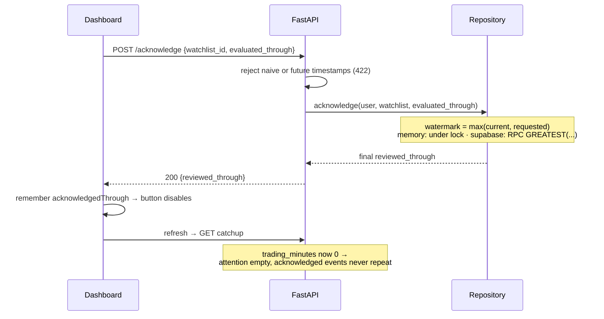
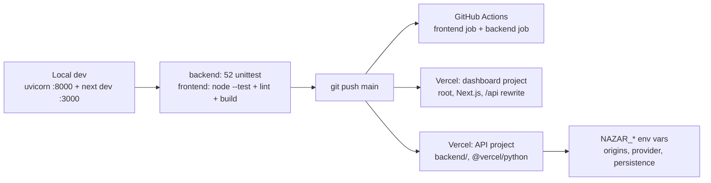

# Application Workflow — How the Technology Fits Together

End-to-end description of how data and control flow through Nazar, from a browser opening the dashboard to a signal appearing with its evidence. Companion to [application.md](application.md) (what each part is); this document is about *how the parts move*.

## 1. System topology

Two request paths reach the API: in production the dashboard calls its **own origin** and Vercel's rewrite (`vercel.json`) proxies `/api/*` server-side to the API project (no CORS involved); in local dev the browser calls `http://localhost:8000` directly and the API's CORS middleware allows the localhost origin.

## 2. The core loop: catch-up request

What happens on every dashboard load and refresh (`GET /api/watchlists/me/catchup`):

Key properties: shared market evidence is computed **per symbol**, per-user state is only membership + rules + watermark; every signal carries `occurred_at`, percentile, observation count, and evidence keys the UI renders verbatim; degraded data lands in `data_unavailable` instead of being ranked.

## 3. Signal computation pipeline

For each stock in the interval `(reviewed, evaluated]`:

1. **Baseline** — last candle at or before `reviewed`; all change-% and crossings measure from it.
2. **Personal rules** — `first_crossed_above/below` scan candle highs/lows for the first threshold crossing (a rule already satisfied at baseline can never fire); volume rules compare cumulative session volume to the median of ≥20 same-minute historical sessions and report the first crossing of the user's multiple.
3. **Sector surprise** — stock and sector candles are aligned by timestamp; `relative return = stock return − sector return` over the selected horizon; placed on the empirical distribution of ≥120 historical relative returns; reported only at ≥95th percentile of absolute deviation from the historical median.
4. **Path events** — running peak/trough scan produces upward/downward excursions and both reversal magnitudes with the timestamp where each extreme completed; each is scored against its own historical distribution; only the single most unusual event ≥95th percentile is reported. A path event **confirmed from fresh data before a feed outage** is preserved and still shown on an unavailable card (`services/events.py`).
5. **Grouping** — any signal ⇒ Attention; none ⇒ Normal; degraded data ⇒ Unavailable (with any preserved confirmed events).

Replay and live modes run the *same* functions; they differ only in where candles and histories come from (recorded dataset vs. Groww + Supabase distributions — the latter pipeline is built but not yet wired, see fixes/05).

## 4. Replay projection (frontend time travel)

The replay slider never refetches. The mapper stamps each signal with a `triggerIndex` — the chart position where its `occurred_at` falls. `projectStock(stock, replayIndex)` then projects every card to a moment in time: price at that index, only signals with `triggerIndex ≤ replayIndex` visible, and the Attention/Normal grouping recomputed from the visible set. Play mode advances the index every 700 ms and stops at the end. This is why scrubbing the slider makes signals appear exactly when they happened — the UI replays the backend's evidence rather than recomputing it.

## 5. Acknowledge (review watermark) flow

Monotonicity is enforced at the storage layer (`max`/`GREATEST`), so replayed or out-of-order acknowledgements can never move the watermark backward — the same guarantee across devices in Supabase mode.

## 6. Mutation flows

Add stock, add rule, and remove stock share one shape: dialog/button → `nazarApi()` POST/DELETE with the bearer token → repository ownership check (`PermissionError` → 404) → success toast → `refresh()` refetches the catch-up so the backend re-groups everything (e.g. a new price rule that already crossed moves its stock into Attention on the next response). Failures surface the backend `detail` in an error toast; the error banner with Retry covers total API outage.

## 7. Live-mode specifics

- **Default window:** first-time users get a watermark ~5 trading sessions back (`default_live_watermark`, trading-minute aware, 14-day cap) instead of a fixed 4 hours.
- **Staleness:** during market hours, a latest candle older than 3 minutes moves the stock to Unavailable with an explicit narrative.
- **Honest degradation:** cards state that statistical distributions are not loaded, and name any volume-pace rule that could not be evaluated.
- **Failure mapping:** any provider-layer failure becomes a 502 with a retry-shortly message (never a raw 500), logged server-side.
- **Data pipeline (built, awaiting wiring):** 1-minute candles → `market_candles` → `jobs/rebuild_distributions.py` computes per-horizon sector-relative and path distributions → `stock_distributions`. Once live mode reads that table (fixes/05), sector-surprise and path signals switch on outside replay.

## 8. Development and delivery workflow

Local setup, env variables, and test commands are in [application.md §6–7](application.md). Deployment hardening (Supabase persistence for serverless, removing deployment protection from the demo URL, env-driven rewrite) is tracked in the fix guides and [bugs.md](bugs.md).
